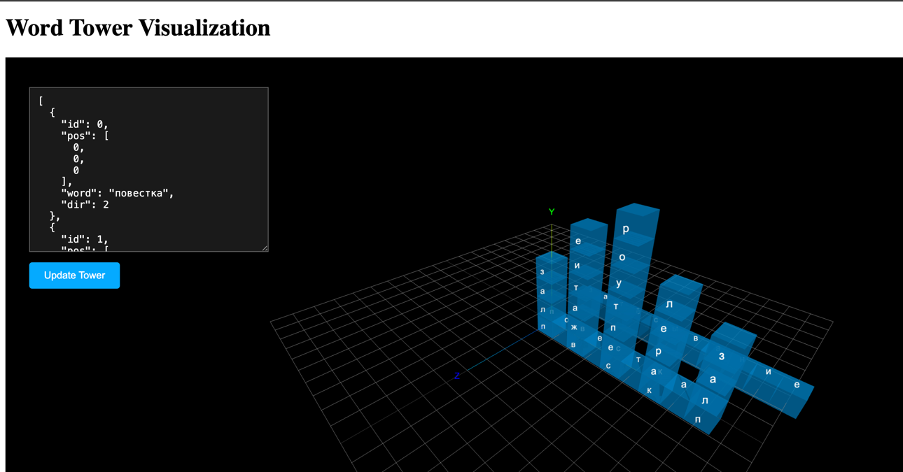

run `npm install && npm start` to start

you will get the following page by accessing http://localhost:3000/

image.png

the input expects your tower json, but slightly modificated:

```json
  {
    "id": 0,
    "pos": [
      0,
      0,
      0
    ],
    "word": "повестка",
    "dir": 2
  },
```

as you can see the "word" field is required to visualize your words
